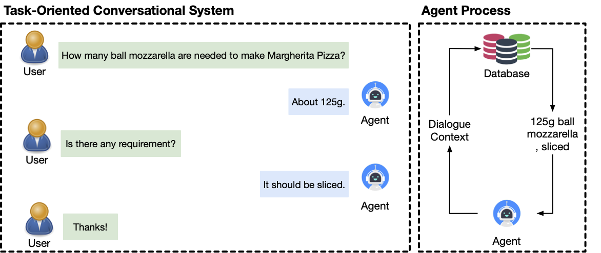
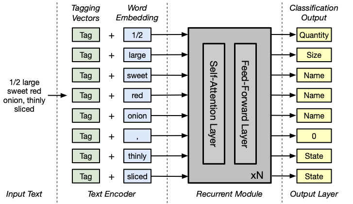

# IngredientParser
Here are the dataset and codes for our paper "[**Attention-based Ingredient Parser**]()". 

## Introduction
As virtual personal assistants have now penetrated the consumer market, with products such as Siri and Alexa, the research community has produced several works on *task-oriented dialogue tasks* such as hotel booking, restaurant booking, and movie recommendation.

<p align="center">
    
</p>
<p align="center">
    <b>Applications of our ingredient parser model for conversational systems. </b>
</p>
Assisting users to cook is one of these tasks that are expected to be solved by intelligent assistants, where ingredients and its corresponding attributes, such as name, unit, and quantity, should be provided to users precisely and promptly. To provide an engaged and successful conversational service to users for cooking tasks, we propose a new ingredient parsing model.
<p align="center">
    
</p>
<p align="center">
    <b>Model architecture.</b>
</p>


## Code
To reproduce our result, please follow the instructions below:
### 1. Download Pre-trained Glove Embedding
You can skip this step since `data/vocab.pkl` is provided.
```
cd data
wget https://nlp.stanford.edu/data/glove.42B.300d.zip
unzip glove.42B.300d.zip
cd ..
```

### 2. Training
```
python train.py --seed 0 --path saved_model_path
```

### 3. Infering
```
python infer.py --path saved_model_path
```

### 3. Infering
```
python test.py --path saved_model_path
```

## Dataset
The source of the dataset is `https://github.com/cosylabiiit/Recipedb-companion-data`.
- `ar_train.tsv` and `ar_test.tsv` are from `AllRecipes Food Corpus`;
- `gk_train.tsv` and `gk_test.tsv` are from `FOOD.com corpus`;
- `ar_gk_train.tsv` and `ar_gk_test.tsv` are from `AllRecipes Food Corpus` and `FOOD.com corpus`.


## Citation
```
@inproceedings{Shi2022attention,
title = {Attention-based Ingredient Parser},
author = {Shi, Zhengxiang and Ni, Pin and Wang, Meihui and Lipani, Aldo},
year = {2022},
keywords = {Named Entity Recognition}
}